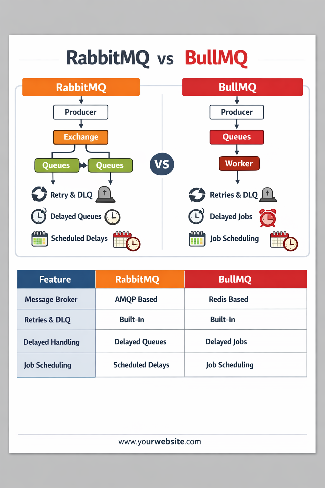
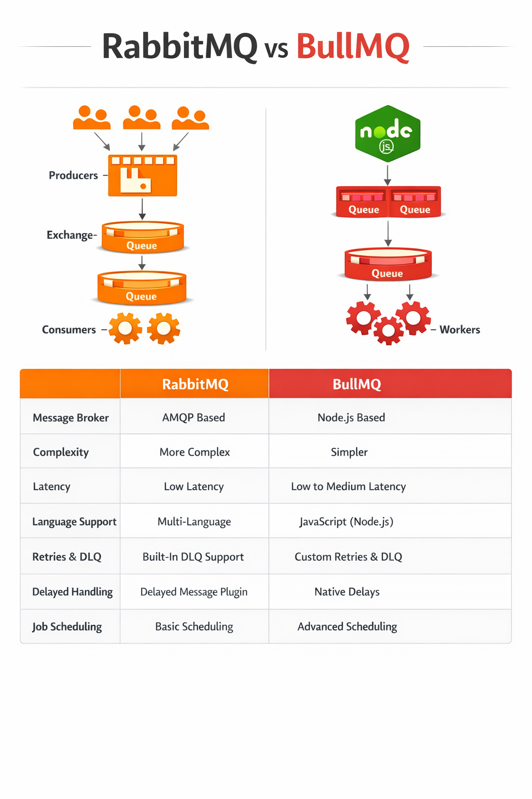

# 1. RabbitMQ

**What it is**:

RabbitMQ is a message broker — think of it like a post office for your software. Applications send “letters” (messages) to RabbitMQ, which stores them safely and delivers them to the right “mailbox” (queue) for other applications to process.

*** Key features ***:

Reliable messaging – messages can be persisted to disk, so they aren’t lost if RabbitMQ restarts.
Flexible routing – supports exchanges (direct, fanout, topic) to route messages to queues.
Acknowledgements – consumer confirms message processed; otherwise, it can be retried.
Supports multiple languages – any language with AMQP client libraries.

***When to use RabbitMQ***:
You need complex routing of messages between services.
Guaranteed delivery is important.
You have high throughput but not ultra-low latency requirements.
You need features like delayed messages, dead-letter queues, or message TTL.

***Example use case***:

E-commerce order processing: an order service sends messages to RabbitMQ → inventory service, payment service, and shipping service consume from queues.

# 2. BullMQ

**What it is**:
BullMQ is a Node.js library for handling jobs and queues, built on Redis. It’s more like a task manager, focused on background processing of jobs, rather than a general-purpose message broker.

***Key features***:

Job queues – schedule tasks now or in the future.
Retries & failures – automatically retries failed jobs.
Concurrency control – can process multiple jobs in parallel.
Event-driven – you can listen for job completion, failure, or progress.
Lightweight & fast – Redis handles the storage, making it extremely fast.

***When to use BullMQ***:

You need background processing (sending emails, generating reports, video transcoding).
Tasks can be retried if they fail.
You want delayed or scheduled jobs.
You are already using Node.js and Redis.

***Example use case***:

Sending batch emails: add email tasks to a BullMQ queue → workers send emails asynchronously.

# 3. Key Differences
** Feature / Aspect	RabbitMQ	BullMQ (Redis) **
Type	General-purpose message broker	Node.js job/task queue
Persistence	Disk-based optional (durable queues)	Redis-based (can be in-memory or persistent)
Routing	Advanced (exchanges, topics, routing keys)	Basic (jobs go to queues, no complex routing)
Use case	Service-to-service communication	Background job processing in Node.js
Language support	Any (AMQP clients available)	Node.js only
Complexity	Higher – needs setup & management	Lower – lightweight & fast
Latency	Moderate (slightly slower)	Very low (Redis in-memory operations)
Retry / Failure Handling	Manual config or plugins	Built-in retry, delayed jobs, and backoff
4. When to choose which

**RabbitMQ**:
Use it when you need robust, multi-service messaging, cross-language communication, and complex routing. Good for microservices architectures.

**BullMQ**:
Use it when you need Node.js background job processing, scheduled tasks, and fast queueing with simple routing. Perfect for tasks that don’t need cross-service AMQP communication.

✅ Summary:

RabbitMQ = multi-language, complex, reliable messaging.

BullMQ = Node.js-specific, fast, background job processor using Redis.

4️⃣ How to Test

Install dependencies:

npm install

Start Redis locally (default 127.0.0.1:6379).

Run workers in separate terminals:

npm run start:work
npm run start:pubsub1
npm run start:pubsub2
npm run start:routing
npm run start:delayed

Add jobs by running the corresponding queue scripts:

node Queue/workQueue.js
node Queue/pubsubQueue.js
node Queue/routingQueue.js
node Queue/delayedRetryQueue.js
node Queue/priorityQueue.js

✅ You’ll see all jobs processed with proper distribution, fanout, routing, delayed & retry handling, and priority.